<p align="center">
  <h2 align="center">Target Set Selection on Social Networks</h2>
    <br>
  <p align="center">
    <b>Nicola De Cristofaro - 0522500876</b><br>
    Social Networks course project <br>
	  Department of Computer Science, Master's Degree, Cloud Computing curriculum <br>
	  University of Salerno <br>
    Email: n.decristofaro2@studenti.unisa.it  
  </p>
</p>

# Problem Description
The phenomenon of social influence has been extensively studied as it can bring benefits in different contexts. Social Influence is the process by which individuals adjust their opinions, revise their belief, or change their behaviours as a result of interactions with other people. In particular, this process has gained a lot of interest from advertisers to exploit "viral marketing" namely the spread of information about products and their adoption by people.

In the context of viral marketing, the problem could be stated as follow: 
- given a social network, find a small number of individuals **(Target Set)**, who when convinced about a new product will influence others by word-of-mouth, leading to a large number of adoptions of the product.

This small number of individuals that constitutes the target set are called **seeds**, individuals who are expected to use their social network position or personal influence to trigger cascades of product adoption.

**Our problem is to minimize the number of seeds, in other words we want to find the minimum target set for which we will be able to influence the entire network.**

# Formalization of the problem
**Instance:**
- Given G = (V,E) a graph that models the network
- Given the function
<div style="text-align: right">
 </div>
assigning **tresholds** to the vertices of G. 
   
   *What do the thresholds represent?* For each node v ∈ V, the value **t(v)** quantifies how hard it is to influence node v, in the sense that easy-to-influence nodes of the network have “low” threshold values, and hard-to-influence nodes have “high” threshold values.

**Problem:**
*Find a target set S ⊆ V of minimum size for G*
Dato un grafo non direzionato G=(V,E)

**Extra Requirement:**
Instead of considering all the edges of the graph that models the network, we want to consider a subset of them. How? Let us consider a probability distribution associated with the edges of our graph G.
 where **p(u,v) = probability with which an active node u influences its neighbor v.**

We apply the principle of deferred decision: for each edge of the graph a pseudorandom number between 0 and 1 is generated. If the generated number is less than the probability present on the edge (i.e. the node infects with a probability lower than the required one), the edge is removed from the graph.

# Software Used
- <b> Python language</b> 

- <b> Snap.py (SNAP for Python) </b>: Stanford Network Analysis Platform (SNAP) is a general purpose network analysis and graph mining library. It efficiently manipulates large graphs, calculates structural properties, generates regular and random graphs, and supports attributes on nodes and edges. For details [https://snap.stanford.edu/index.html](https://snap.stanford.edu/index.html)

# Implementation
Below we explain the implementation of the algorithm and the implementation choices (we refer to the python file "TSS_execution.py").

1. The first step is about taking parameters from command line regarding the the probability function to be used as well as that of thresholds with the values of the constants if they are necessary.

2. The second step is to load the graph that models the dataset we are using.

```Python
G = None
if datasetPath.endswith('.csv'):
    G = snap.LoadEdgeList(snap.TUNGraph, datasetPath, 0, 1, ',')
else:
    G = snap.LoadEdgeList(snap.TUNGraph, datasetPath, 0, 1, '\t')
```

The datasets considered could be in ".csv" format and in that case we have to read them with comma separator otherwise a dataset could be stored in ".txt" file, in this case we read it with tab separator.

The we print information about the graph loaded. 

```Python
print("\nOriginal Graph Info:")
print_graph_basic_info(G)
print_graph_deg_info(G)
print_graph_extra_info(G)
```

These functions are defined in the file "TSS_utils.py". What information about the graph can they give?

- **print_graph_basic_info(G):** it prints the number of nodes and the number of edges of the graph G passed as parameter
- **print_graph_deg_info(G):** it prints the maximum node degree in the graph G passed as parameter
- **print_graph_extra_info(G):** it prints the average node degree and the clustering coefficient in the graph G passed as parameter.

**Example**
```
Dataset =  CA-GrQc

Original Graph Info:
Number of nodes = 5242
Number of edges = 14496
Max Node Degree = 81
Avg Node Degree = 6
Clustering coefficient = 0.5304030148368244
```

## Edges pre-computation
As extra requirement we consider a probability distribution associated with the edges of our graph G. In this project we selected different probability functions and then in the tests section we analyze the differences between them.

These probability functions are considered:
- **Random**: a random probability is assigned to the edges

```Python
def random_edge_probability_distribution():
    return rand.uniform(0,1)
```

- **Degree-based**: let's consider an edge between the nodes u and v. The probability p(u,v) assigned to this edge is equal to 1 - (1 / sum of the degrees of the source node u and of the target node v). The higher the sum of the degrees of the nodes, the greater the probability assigned to that edge and consequently the greater the probability that this edge will not be removed.

```Python
def degree_based_edge_probability_distribution(graph, edge):
    source_node = graph.GetNI(edge.GetSrcNId())
    dest_node = graph.GetNI(edge.GetDstNId())
    source_node_degree = source_node.GetDeg()
    dest_node_degree = dest_node.GetDeg()

    return (1 - (1/(source_node_degree+dest_node_degree)))
```
- **Constant**: a constant user-defined probability is assigned to the edges and is the same for all.

We can now apply the principle of deferred decision: for each edge of the graph a pseudorandom number between 0 and 1 is generated. If the generated number is less than the probability present on the edge (i.e. the node infects with a probability lower than the required one), the edge is removed from the graph. This principle is implemented as follows:

```Python
def edge_filtering(graph, propability_function, **kwargs):
    edges_to_remove = []

    if propability_function == "random":
        for e in graph.Edges():
            if random_edge_probability_distribution() < rand.uniform(0,1):
                edges_to_remove.append((e.GetSrcNId(),e.GetDstNId()))
    elif propability_function == "constant":
        for e in graph.Edges():
            const = kwargs.get("const", None)
            if const < rand.uniform(0,1):
                edges_to_remove.append((e.GetSrcNId(),e.GetDstNId()))
    elif propability_function == "degree_based":
        for e in graph.Edges():
            if degree_based_edge_probability_distribution(graph, e) < rand.uniform(0,1):
                edges_to_remove.append((e.GetSrcNId(),e.GetDstNId()))
    else: print("The probability distribution function specified is not supported")
    
    for e in edges_to_remove:
        graph.DelEdge(e[0], e[1])
```

## Nodes Threshold initialization
We remember that for each node v ∈ V, the threshold value **t(v)** quantifies how hard it is to influence the node v, in the sense that easy-to-influence nodes of the network have “low” threshold values, and hard-to-influence nodes have “high” threshold values.

How can we initialize these nodes thresholds values? In the paper on which this project is based the thresholds are constant among all vertices (precisely the constant value is an integer in the interval [1,10]) and for each node v the threshold t(v) is set as **min{t, degree(v)}** where t = 1,2,..,10.

Here we use the same technique, but instead of considering only constant thresholds we also consider an alternative based on the degree of the node, so in this case the threshold t(v) of a node v with degree d(v) is equal to **min{a * d(v)/b, d(v)}** where "a" and "b" are user-defined coefficients.

These threshold functions are implemented as follows:

```Python
def threshold_setting(graph, threshold_function, **kwargs):
    node_threshold_mapping = {}
    if threshold_function == "constant":
        for v in graph.Nodes():
            const = kwargs.get("const", None)
            node_threshold_mapping[v.GetId()] = min(const,v.GetDeg()) # min(const, d(v))
    elif threshold_function == "degree_based":
        for v in graph.Nodes():
            a = kwargs.get("a", None)
            b = kwargs.get("b", None)
            node_threshold_mapping[v.GetId()] = min(math.ceil((a * v.GetDeg() / b)),v.GetDeg()) # min(t(v) = a * d(v) / b, d(v))
    else: print("The threshold function specified is not supported")

    return node_threshold_mapping
```

The structure returned from the call of this function is a dictionary, a key-value structure where the key is the node ID and the value is the node's threshold.

## TSS execution
Below I make a brief description in words of the algorithm whose code is shown next.

We want to select a node v of the graph and eliminate it from the graph following the rules below:
- **CASE 1**: node v has threshold t (v) = 0 which means that the current set of nodes in S are able to activate v. In this case it will affect its neighboring nodes once active and then it can be eliminated from the graph.
- **CASE 2**: node v has a lower degree than its threshold, so in this case the node v must be nbecessarily added to the current solution set S since there is no possibility to activate v through its neighbors, in other words, having a few link nobody can influence it. Coherently, its neighbors’ thresholds are decreased by 1, since they receive v’s influence. Once a node is added to S, it is deleted from the graph.
- **CASE 3**: if the above cases do not occur Case 3
holds and a vertex is selected to be discarded; such a vertex is chosen as to maximize a properly chosen function that, for each node, is directly proportional to its remaining threshold and inversely proportional to its degree.

It is returned the Target Set S resulting.

Code shown below:
```Python
def target_set_selection(graph, node_threshold_mapping):
    S = set()
    active_ready_set = set()
    while graph.GetNodes() > 0:
        max_node_id = -1
        max_ratio_value = -1
        node_id_to_add_to_ts = None

        for v in graph.Nodes():
            #CASE 1
            if node_threshold_mapping[v.GetId()] == 0: 
                active_ready_set.add(v.GetId())
            else:
                if v.GetDeg() < node_threshold_mapping[v.GetId()]:
                    #CASE 2 
                    node_id_to_add_to_ts = v.GetId()
                else:
                    #CASE 3
                    denominator = v.GetDeg()*(v.GetDeg()+1)
                    if denominator == 0: ratio = 0
                    else: ratio = node_threshold_mapping[v.GetId()] / denominator
                    if ratio > max_ratio_value:
                        max_node_id = v.GetId()
                        max_ratio_value = ratio

        #update thresholds and node delete
        if(len(active_ready_set) > 0):
            while(len(active_ready_set) > 0):
                node_id = active_ready_set.pop()
                _,NodeVec = graph.GetNodesAtHop(node_id, 1, False) #get node's neighborhood
                for item in NodeVec:
                    #decrement of 1 the threshold of neighbors nodes still inactive
                    if node_threshold_mapping[item] > 0: node_threshold_mapping[item] -= 1

                graph.DelNode(node_id)

        else:
            if node_id_to_add_to_ts != None:
                S.add(node_id_to_add_to_ts)
                _,NodeVec = graph.GetNodesAtHop(node_id_to_add_to_ts, 1, False) #get node's neighborhood
                for item in NodeVec:
                    #decrement of 1 the threshold of neighbors nodes still inactive
                    if node_threshold_mapping[item] > 0: node_threshold_mapping[item] -= 1

                graph.DelNode(node_id_to_add_to_ts)
            else:
                graph.DelNode(max_node_id)

    return S
```

We can notice the use of the function **"GetNodesAtHop(StartNId, Hop, IsDir)"** provided by SNAP library that is a graph method that finds the node ids of all the nodes that are at distance *Hop* from node *StartNId*. The parameter *isDir* indicates whether the edges should be considered directed (True) or undirected (False), like in this case. The function returns the number of nodes found (that is not needed in this case) and *NIdV* a vector of ints, namely node ids of nodes Hop distance away from StartNId.


## Notes on probabilistic nature
Because of the initial edge pre-computation, that removes edges from the graph, is based on probability, in two different iterations of the algorithm we can end up with slightly different solutions. This is because a certain number of edges may be removed in one iteration and a slightly different number in the other.

So to make our solution have value we will carry out the steps described above for 10 iterations, for each of them we will take the size of the resulting target set and make an average of it.

# How to execute

## Requirements
- Python
- SNAP for Python
- matplotlib.pyplot (if you want to be able to generate graphics)

You can run the python file "TSS_execution.py" to execute the implemented algorithm. You should specify as parameters:
  - the dataset path in your local machine
  - the probability distribution function you want use (if constant you shold also add the constant)
  - the threshold function to use (with constant or coefficient a,b depending on what function you use)
  Here is an example:

```
python3 TSS_execution.py ./Datasets/Arxiv_GR-QC/CA-GrQc.txt constant 0.2 degree_based 1 2
```

# Computational Complexity


# Datasets
To carry out the tests on the implemented algorithm, the datasets provided by SNAP were used ([https://snap.stanford.edu/data/index.html](https://snap.stanford.edu/data/index.html)). In particular, in the "Social Networks" category and in "Collaboration networks" category.

The following datasets were used:
- **Twitch Social Networks:** in this dataset nodes are the users of Twitch Social Network and the links are mutual friendships between them. These social networks data were collected in May 2018 and they are organized depending on the language used by users (we consider the ENG variant).
- **General Relativity and Quantum Cosmology collaboration network (ca-GrQc):** a collaboration network that covers scientific collaborations between authors papers submitted to General Relativity and Quantum Cosmology category. If an author i co-authored a paper with author j, the graph contains a undirected edge from i to j.
- **High Energy Physics - Theory collaboration network (ca-HepTh):** a collaboration network that covers scientific collaborations between authors papers submitted to High Energy Physics - Theory category. If an author i co-authored a paper with author j, the graph contains a undirected edge from i to j. 

Here are some statistics on the datasets used:

| Dataset Name 	| #nodes 	| #edges 	| Max Node Degree 	| Avg Node Degree 	| Clustering Coefficient 	| Website link for download                                  	|
|--------------	|--------	|--------	|-----------------	|-----------------	|------------------------	|------------------------------------------------------------	|
| musae-twitch 	| 7126   	| 35324  	| 720             	| 10              	| 0.13092821901472068    	| https://snap.stanford.edu/data/twitch-social-networks.html 	|
| ca-GrQc      	| 5242   	| 14496  	| 81              	| 6               	| 0.5304030148368244     	| https://snap.stanford.edu/data/ca-GrQc.html                	|
| ca-HepTh     	| 9877   	| 25998  	| 65              	| 6               	| 0.4718599657052348     	| https://snap.stanford.edu/data/ca-HepTh.html               	|

# TSS algorithm correctness
To verify the correctness of the implemented algorithm, the same experiments performed on the paper on which this work is based were carried out. In particular, two datasets were considered in the category of "Collaboration networks": ca-GrQc and ca-HepPTh (described before).

TSS algorithm is executed without the initial edge pre-computation and the thresholds are constant among all vertices (precisely the constant value is an integer in the interval [1,10]) and for each node v the threshold t(v) is set as **min{t, degree(v)}** where t = 1,2,..,10.

We produce the same graphic presented on the paper, so we can see the same values for the target set size resulting, which proves the correctness of implementation (code to check the correctness is in "TSS_correctness.py" file).

- On the left, my implementation results, on the right paper implementation results (red line with * scatter).

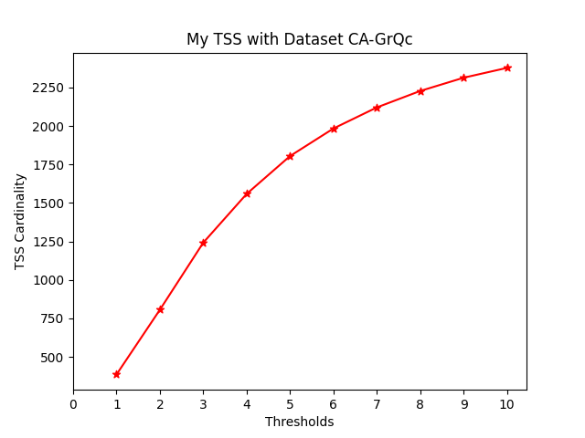 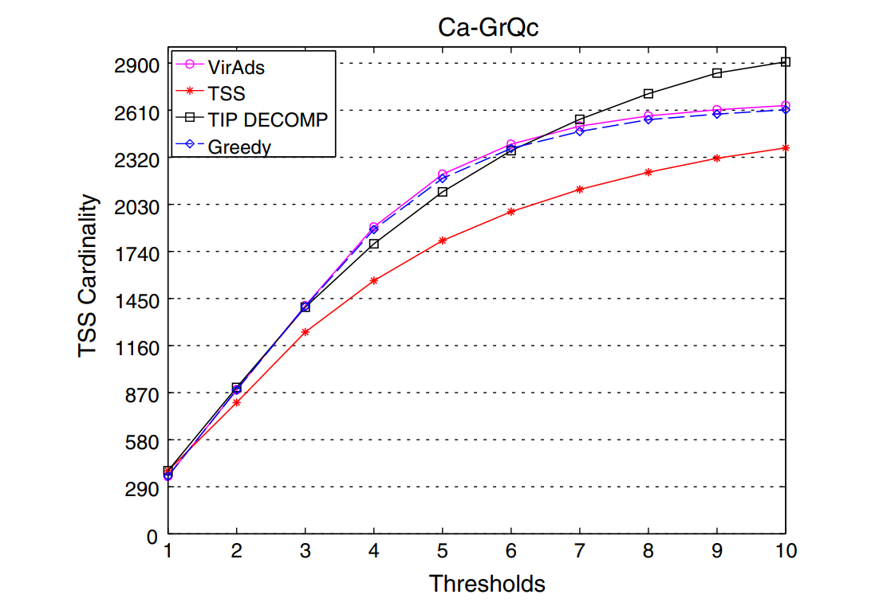

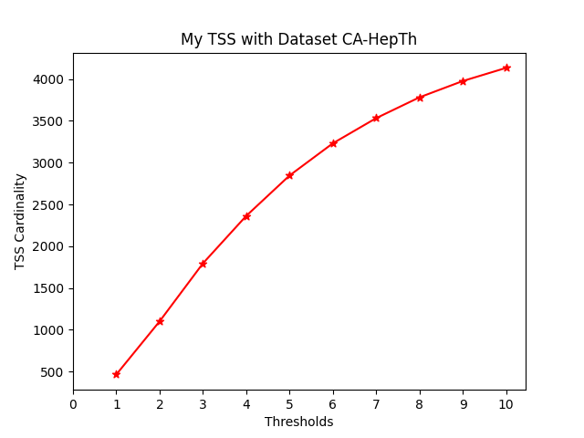 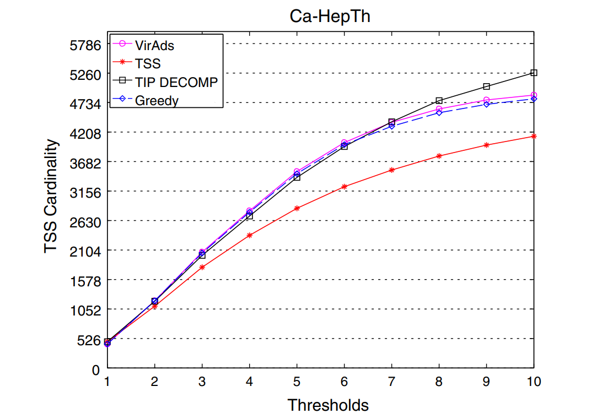 

# Tests execution and results discussion

## Edges pre-computation tests
First of all, tests were carried out to understand how the choice of the probability functions on the edges of the graph affected the removal of the edges themselves.

From the following graphic we can see, for each dataset considered, the number of edges on the original graph and then how this number is reduced following the removal of the edges after applying the deferred decision principle. 

In fact, we can see, for each dataset, the number of edges by applying a constant probability on the edges of 0.2, then constant of 0.6, then again a random probability and finally a probability that depends on the degree of the source node and recipient node of the edges considered(details seen in above sections).

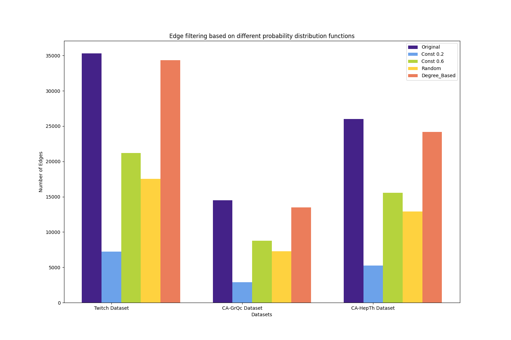

*What do we notice?*
- Using constant values as probability on the edges, what we expect happens, that is with a constant as low as 0.2 many edges are removed from the original graph while with the constant 0.6 a smaller number of edges are removed.
- Using a Random probability we notice how the number of edges is roughly halved.
- Finally we note that by using a probability on the edges which is a function of the degree of the source and recipient nodes of each edge, we have a very high number of resulting edges, or rather very few edges are removed. This indicates that the nodes have a fairly high degree, which results in a fairly high probability on the edges which means that most of the nodes influence each other a lot. Practically it means that the pseudorandom number generated is almost never able to be greater and consequently very few edges are removed.

These considerations can be made for all 3 datasets considered.

## TSS tests
In this section we'll make various tests on TSS algorithm implemented on the datasets specified before.

For each dataset we execute "TSS_test_and_graphics_generation.py" giving as parameter the dataset path. Then automatically will be perfomed tests on that dataset varying the probability functions and the threshold functions.

**Probability functions considered**:
- Constant = 0.2
- Constant = 0.6
- Random
- Degree_based

**Thresholds functions considered**:
- Constant = 2
- Constant = 6
- Degree_based (a=1,b=1)
- Degree_based (a=2,b=7)

The combination of these functions results in 16 tests on each dataset. In particular, 4 graphs will be produced for each dataset as described below.

| #Graphic  	| Probability function 	| Varying Threshold function                                                                            	|
|-----------	|----------------------	|-------------------------------------------------------------------------------------------------------	|
| graphic 1 	| Constant 0.2         	| 1.Constant = 2<br> 2.Constant = 6<br> 3.Degree_based (a=1, b=1)<br> 4.Degree_based (a=2, b=7)<br>     	|
| graphic 2 	| Constant 0.6         	| 1.Constant = 2 <br> 2.Constant = 6 <br> 3.Degree_based (a=1, b=1) <br> 4.Degree_based (a=2, b=7) <br> 	|
| graphic 3 	| Random               	| 1.Constant = 2 <br> 2.Constant = 6 <br> 3.Degree_based (a=1, b=1) <br> 4.Degree_based (a=2, b=7) <br> 	|
| graphic 4 	| Degree_based         	| 1.Constant = 2 <br> 2.Constant = 6 <br> 3.Degree_based (a=1, b=1) <br> 4.Degree_based (a=2, b=7) <br> 	|

***The standard output of the tests, for each dataset, can be found in "tests_output" folder**

Below we show the results of the tests in graphics produced with "pyplot" of python.

***The first thing to notice is that in all tests, on all datasets, although the resulting target set size is different, the same proportion is maintained as the threshold function varies. Therefore, the considerations made are valid regardless of the dataset considered in these experiments.**

- **DATASET: musae-twitch** <br>
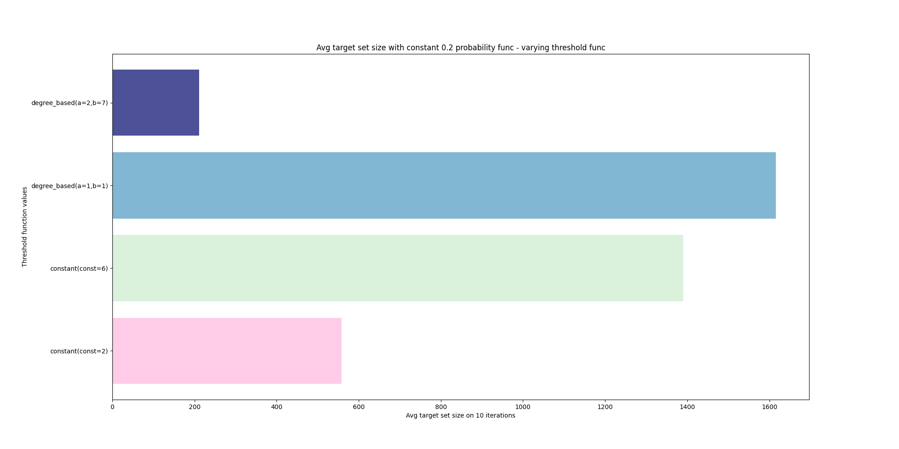 
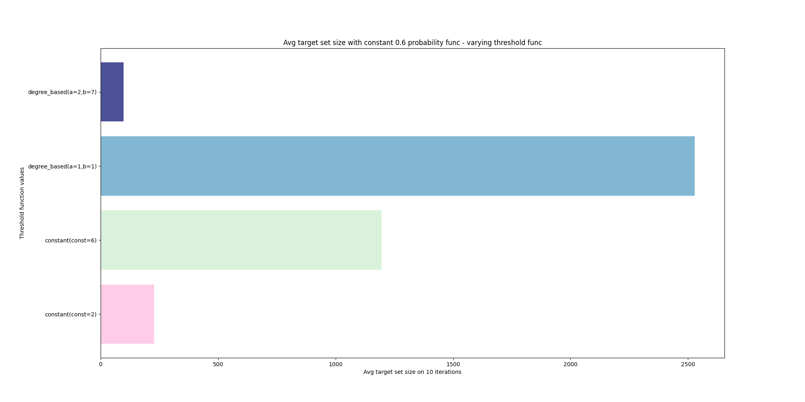
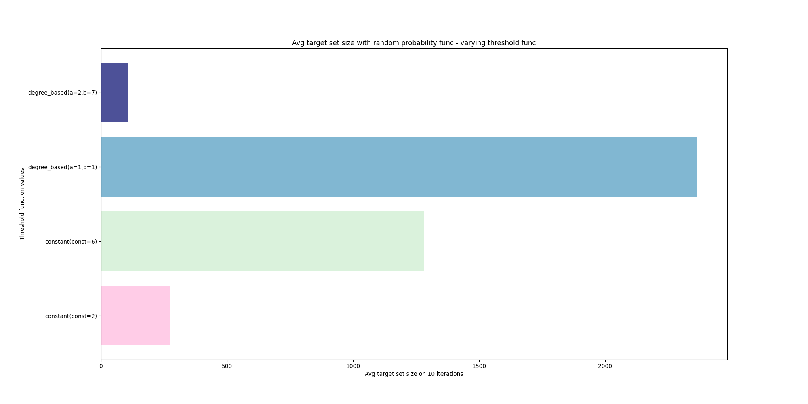
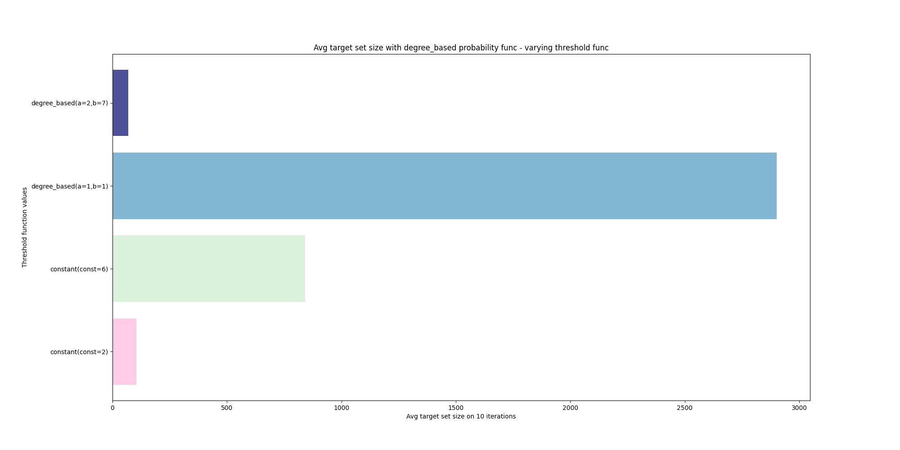

- **DATASET: ca-GrQc** <br>
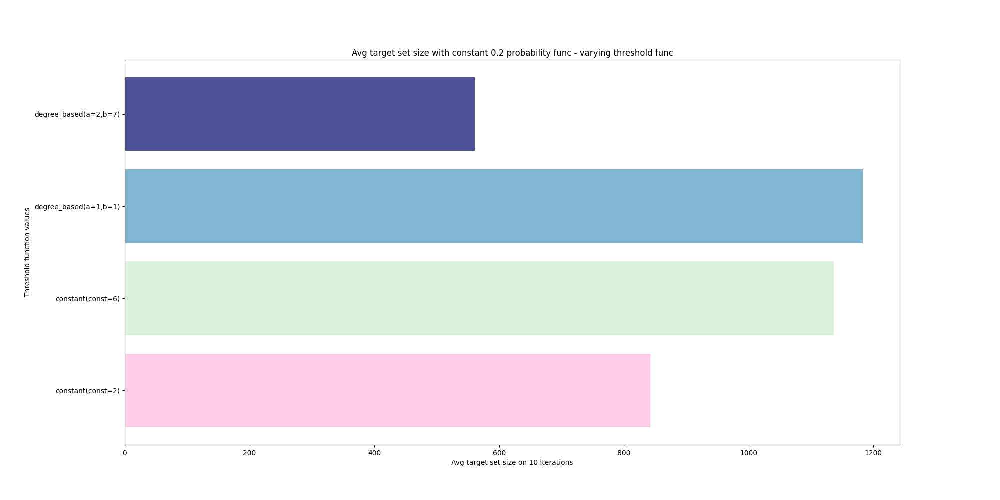
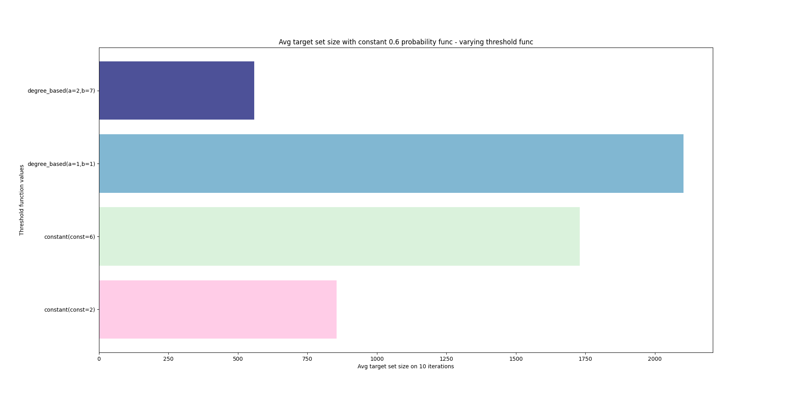
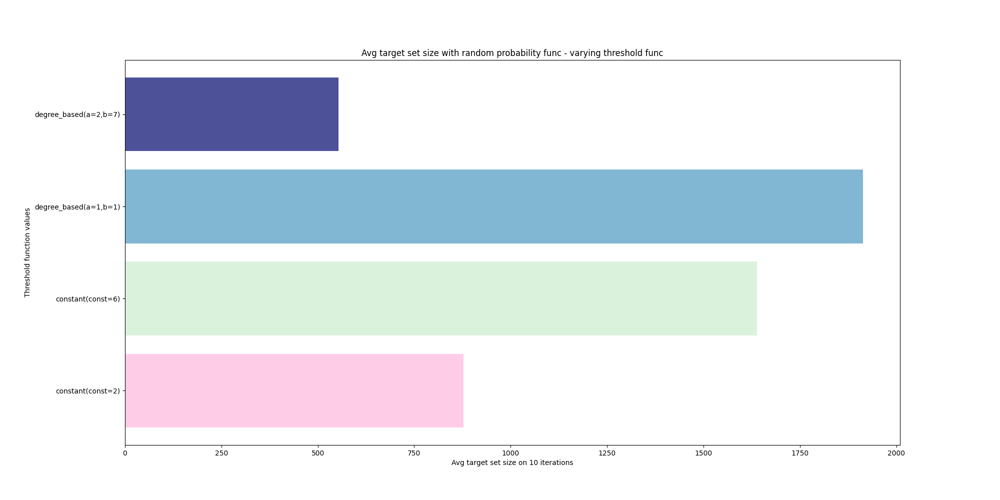
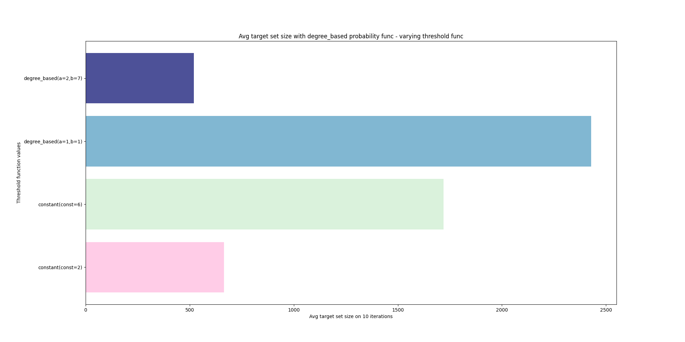

- **DATASET: ca-HepTh** <br>
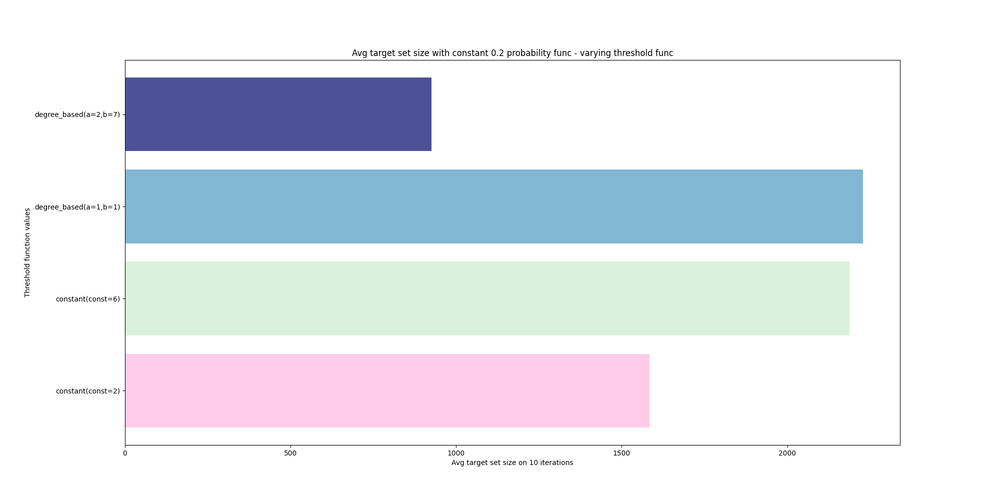
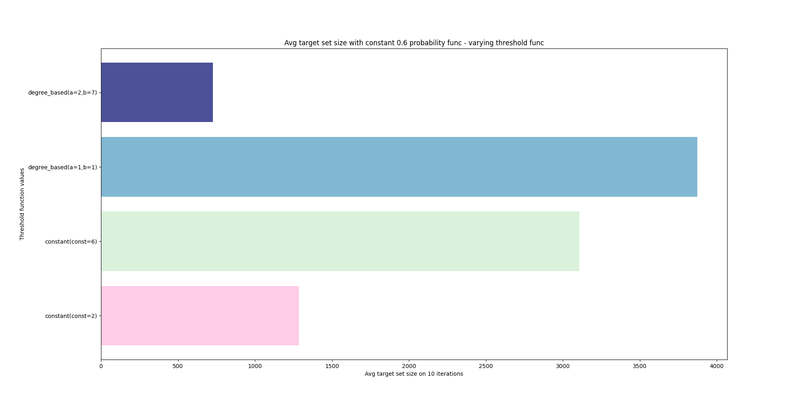
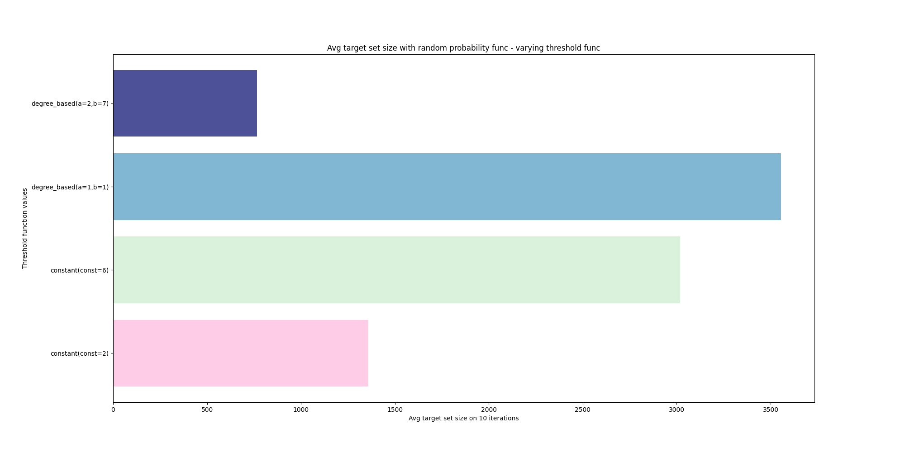
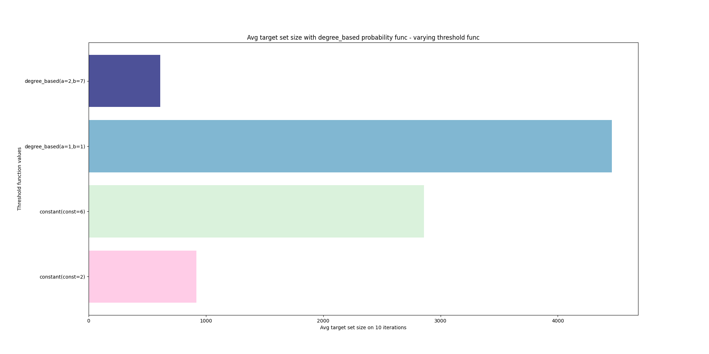

**If the graphic images are not clearly visible they can be found in "graphics" folder for a better visualization.*

**Result Discussion:**

1. When we consider a **degree_based** threshold function with coefficients **(a=2,b=7)** for how the threshold of a node is computed, let's remember the formula:


this turns out to be a very small value in most cases.

*Example*

This is because from the statistics we have seen earlier on the datasets, nodes have a fairly high average rank, in particular 10 for the Twitch dataset and 6 for the other 2, but we have seen how the rank of a node can be much higher. high (max node degree stats).

Consequently, in this situation, with these coefficients, when we go to calculate the minimum in the formula expressed above, the degree is almost never taken as a threshold value but in most cases the alternative is taken because it is a lower value.

Therefore, since in this situation, in most cases we find ourselves with fairly low threshold values ​​of the nodes and we remember that nodes with low thresholds are easy to influence it follows that the size of the target set is very low, the lowest among the tested variants: a small seed set can influence many nodes


# Conclusions